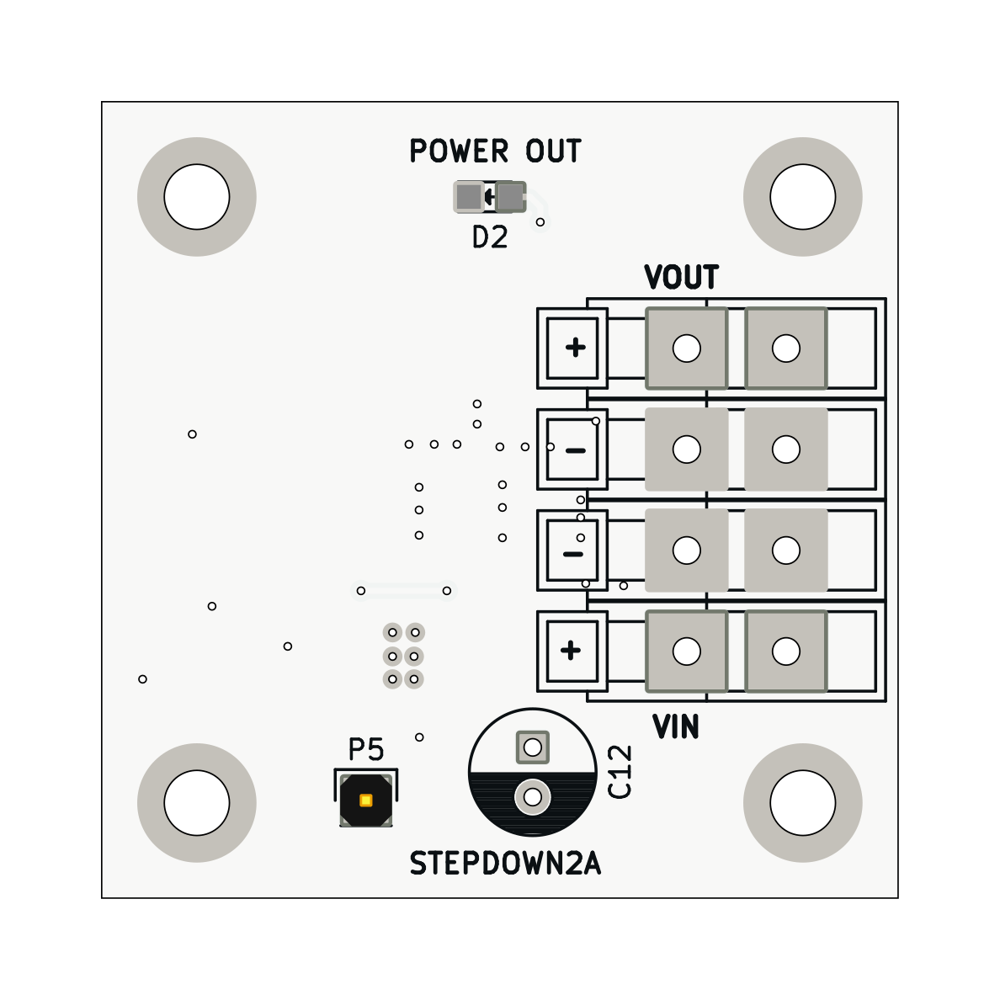
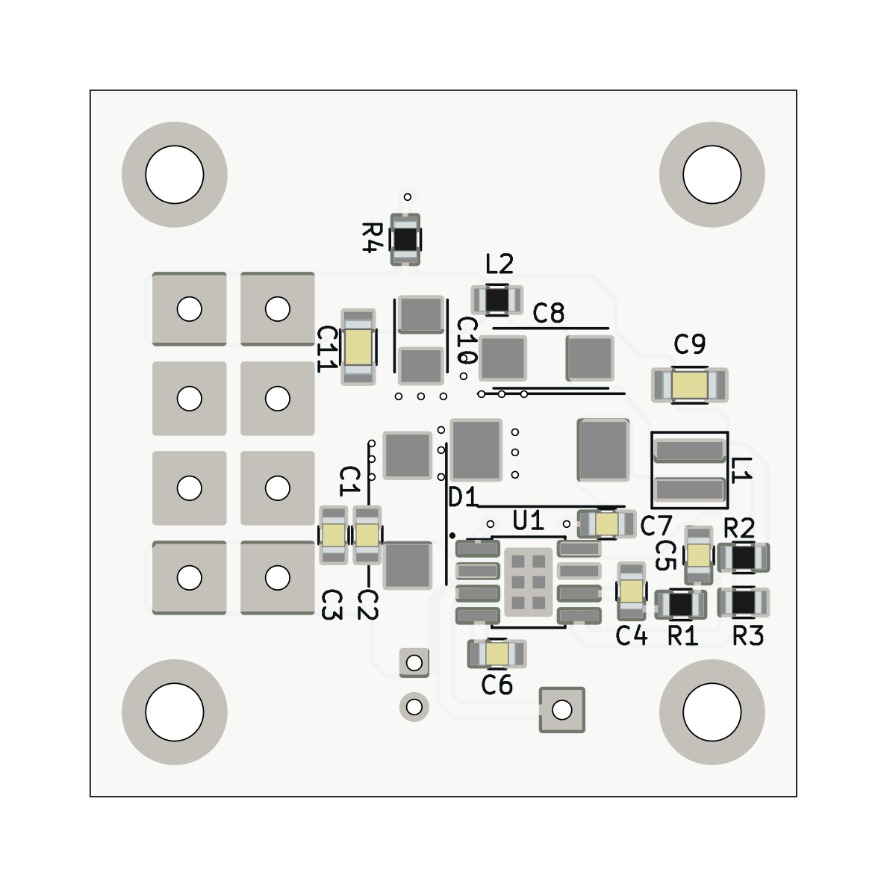

# STEPDOWN02 - 1MHz switching down converter

This repository contains the design files, documentation, and usage instructions for the TPS54332 MLAB module. The TPS54332 is a high-efficiency synchronous buck converter capable of delivering up to 3 A of continuous output current. This development module is designed to integrate the TPS54332 into MLAB projects with ease.

 

 

## Features

- **Input Voltage Range**: 3.5 V to 28 V
- **Output Voltage Range**: 0.8 V to 23 V
- **Output Current**: Up to 3 A
- **Efficiency**: Up to 95%
- **Switching Frequency**: Adjustable up to 2 MHz
- **Integrated High-Side and Low-Side MOSFETs**
- **Cycle-by-Cycle Current Limit, Frequency Fold Back and Thermal Shutdown Protection**

## Getting Started

### Prerequisites

To use this development module, you will need:

- A DC power supply (3.5 V to 28 V)
- Load device (up to 3 A)
- Multimeter or oscilloscope for measurements
- Soldering equipment (if customization of output voltage is needed)

### Installation

1. **Connect the Power Supply**: Connect the positive terminal of your DC power supply to the VIN pin and the negative terminal to the GND pin of the module.
2. **Connect the Load**: Connect your load device between the VOUT pin and GND pin of the module.

### Usage

1. **Adjust Output Voltage**: The output voltage can be adjusted by selecting appropriate values for the feedback resistors (R1 and R2). Refer to the datasheet for the resistor calculation formula.
2. **Monitoring**: Use a multimeter or oscilloscope to monitor the output voltage and current.
3. **Optimization**: Fine-tune the switching frequency and compensation network as required for your application.

## Documentation

- **Datasheet**: [TPS54332 Datasheet](https://www.ti.com/product/TPS54332)

